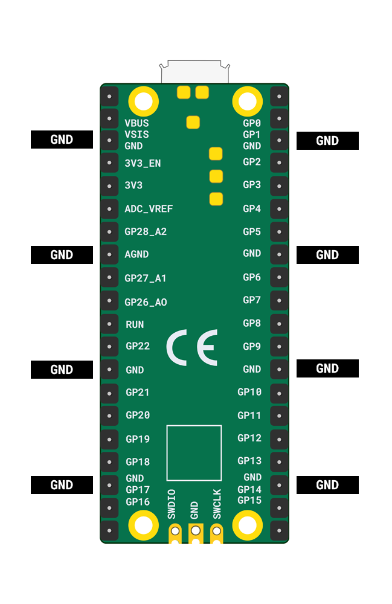

Le Raspberry Pi Pico dispose de huit broches **GND** lorsque tu utilises des fils de liaison, tu ne peux avoir que huit composants à moins que certains partagent une broche **GND**.

{:width="400px"}

Les haut-parleurs ne peuvent jouer qu'une seule note à la fois, tu auras donc besoin de plusieurs haut-parleurs si tu souhaites jouer plusieurs sons en même temps.

Il n'y a qu'une seule broche **3V**, tu ne peux donc utiliser qu'un seul potentiomètre. Il y a aussi une limite à la quantité de courant que le Raspberry Pi Pico peut fournir.

Les combinaisons suggérées d'entrées et de sorties sont :
+ 1 potentiomètre et 1 buzzer
+ 4 boutons et buzzer
+ 8 boutons artisanaux et un buzzer
+ 1 potentiomètre, 2 boutons et 2 buzzers
+ Plusieurs boutons et un nombre correspondant de buzzers pour jouer des accords (plusieurs notes en même temps)

Tu **peux** utiliser plus de composants que **8** mais cela impliquera de partager une broche **GND**.