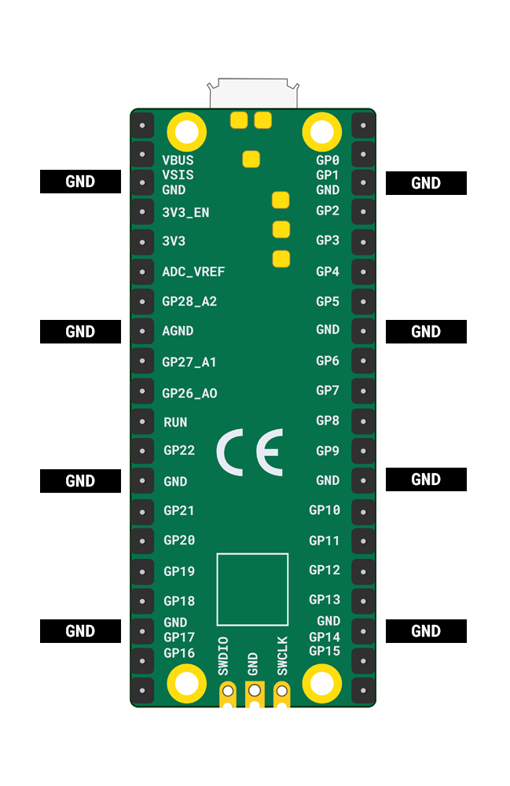

Raspberry Pi Picoには**GND**ピンが8つあるため、ジャンパーワイヤを使用する場合、**GND**ピンを共有するコンポーネントがない限り、コンポーネントは8つしか使用できません。

{:width="400px"}

スピーカーは一度に1つの音しか再生できないため、複数の音声を同時に再生したい場合は複数のスピーカーが必要になります。

**3V**ピンは1つしかないため、1つのポテンショメータしか使用できません。 Raspberry Pi Picoがどのくらいの電流を供給できるかにも制限があります。

入力と出力の推奨される組み合わせは次のとおりです。
+ 1つのポテンショメータと1つのブザー
+ 4つのボタンとブザー
+ 8つの細工を施したボタンと1つのブザー
+ 1つのポテンショメータ、2つのボタン、2つのブザー
+ コードを演奏するための複数のボタンとそれと同じ数のブザー（複数の音を同時に演奏）

**8**つより多くのコンポーネントを使用**できます**が、そのためには**GND**ピンを共有する必要があります。