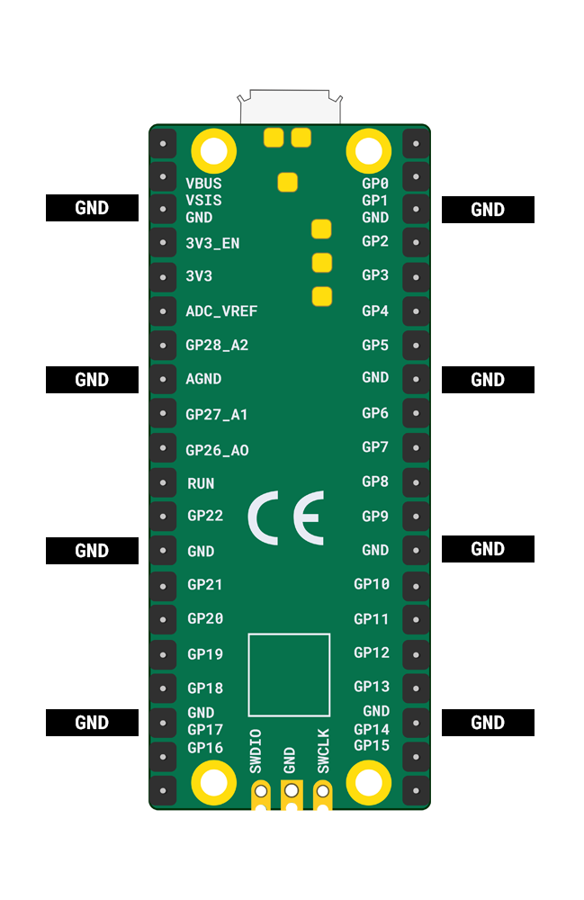

De Raspberry Pi Pico heeft acht **GND** -pinnen, dus als je jumperdraden gebruikt, kun je slechts acht componenten hebben, tenzij sommige een **GND** pin delen.

{:width="400px"}

Luidsprekers kunnen slechts één noot tegelijk spelen, dus je hebt meerdere luidsprekers nodig als je meerdere geluiden tegelijkertijd wilt spelen.

Er is slechts één **3V** pin, dus je kunt slechts één potentiometer gebruiken. Er is ook een limiet aan hoeveel stroom de Raspberry Pi Pico kan leveren.

Voorgestelde combinaties van invoer en uitvoer zijn:
+ 1 potentiometer en 1 zoemer
+ 4 knoppen en zoemer
+ 8 gemaakte knoppen en een zoemer
+ 1 potentiometer, 2 knoppen en 2 zoemers
+ Meerdere knoppen en een bijbehorend aantal zoemers om akkoorden te spelen (meerdere tonen tegelijkertijd)

Je **kunt** meer dan **8** componenten gebruiken, maar dan moet je een **GND** pin delen.